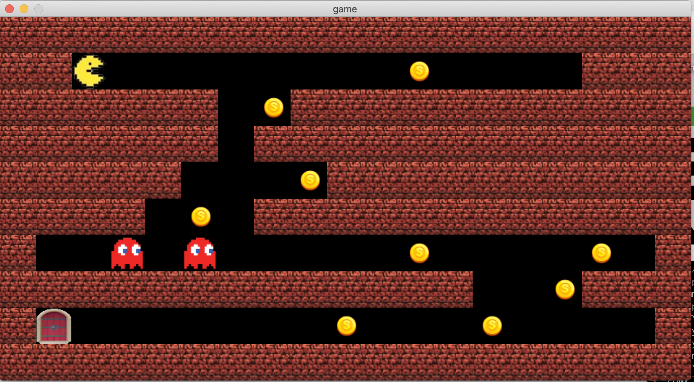

<h1>So Long</h1>

This project is a 2D game developed in C using the MiniLibX library as part of the 42 curriculum.

<h2>Description</h2>

"So Long" is a simple 2D game where the player needs to collect all collectibles in the map and reach the exit. The game counts the number of steps the player takes and displays it on the screen. The game ends when the player reaches the exit after collecting all collectibles.

<h2>Installation</h2>

Clone the repository and compile the code using make.

<pre>
<code>
git clone &lt;repository-url&gt;
cd &lt;repository-directory&gt;
make
</code>
</pre>

<h2>Usage</h2>

Run the game with the following command:

<pre>
<code>
./so_long &lt;map.ber&gt;
</code>
</pre>

Where:

<ul>
<li><code>map.ber</code>: The map file to load for the game. The map file should be a rectangular map with walls surrounding the playable area, 'P' for the player, 'E' for the exit, and 'C' for collectibles.</li>
</ul>

<h2>Controls</h2>

<ul>
<li>W: Move up</li>
<li>A: Move left</li>
<li>S: Move down</li>
<li>D: Move right</li>
<li>Q: Quit the game</li>
</ul>

<h2>Contributing</h2>

Pull requests are welcome. For major changes, please open an issue first to discuss what you would like to change.

<h2>License</h2>

<a href="https://choosealicense.com/licenses/mit/">MIT</a>

